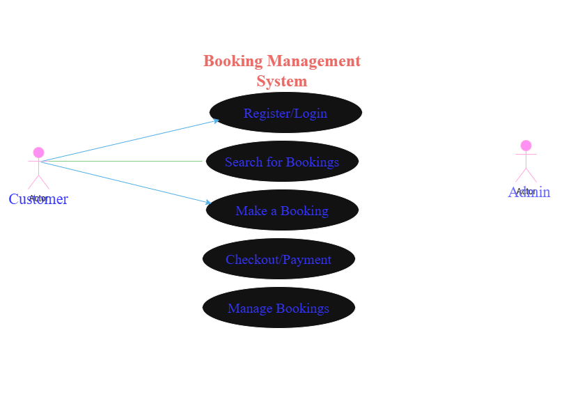

# Requirement Analysis in Software Development

## 📘 Introduction

This repository contains the documentation and analysis for the **Requirement Analysis Project**, which focuses on developing a structured foundation for software development. The goal is to simulate a real-world software development scenario by applying **requirement analysis techniques** to a **Booking Management System**.
This project emphasizes understanding, defining, and structuring requirements to ensure clarity, precision, and alignment with user and business goals.

---

## 🧩 What is Requirement Analysis?

**Requirement Analysis** is the process of identifying, documenting, and managing the needs and expectations of stakeholders for a software project. It forms the backbone of the **Software Development Life Cycle (SDLC)** by clearly defining **what** the system should do and **how** it should behave.

During this phase, analysts gather input from clients, users, and other stakeholders to ensure the final software meets the intended purpose. The output of this process includes **requirement specifications**, **use case diagrams**, and **acceptance criteria** that guide the design and development teams.

### Importance in SDLC:

* It establishes a clear understanding of the project scope and objectives.
* It reduces the risk of rework and cost overruns.
* It ensures that the final product aligns with business goals and user expectations.

---

## 🌟 Why is Requirement Analysis Important?

Requirement Analysis is a **critical phase** of the SDLC because it sets the foundation for all subsequent stages. Below are three key reasons why it is important:

1. **Prevents Miscommunication:**
   It ensures that both developers and stakeholders share the same understanding of what the software is supposed to achieve, avoiding confusion later in development.

2. **Improves Project Planning and Cost Estimation:**
   Clear requirements allow teams to plan resources, timelines, and budgets more accurately.

3. **Ensures Quality and User Satisfaction:**
   By defining detailed acceptance criteria and user needs, the final system can be validated against user expectations, ensuring higher satisfaction.

---

## 🔍 Key Activities in Requirement Analysis

Requirement Analysis involves several well-defined activities that ensure requirements are collected, analyzed, and validated efficiently.

1. **Requirement Gathering:**
   Collecting needs and expectations from stakeholders, end-users, and clients through interviews, questionnaires, and observations.

2. **Requirement Elicitation:**
   Extracting specific, actionable requirements from gathered information to identify the exact needs of users and the system.

3. **Requirement Documentation:**
   Creating clear and structured documents such as Software Requirement Specification (SRS) that detail all functional and non-functional requirements.

4. **Requirement Analysis and Modeling:**
   Evaluating, organizing, and representing requirements visually using models and diagrams (e.g., use case diagrams, data flow diagrams).

5. **Requirement Validation:**
   Ensuring that the documented requirements meet user needs and align with business objectives before moving to the design phase.

---

## 🧠 Types of Requirements

### 1. Functional Requirements

Functional requirements define **what the system should do** — the specific behaviors, features, and functions it must perform.

**Examples for the Booking Management System:**

* Users should be able to **register and log in** to the platform.
* The system should allow users to **search for available bookings** by date, type, or location.
* The system should **process payments** securely during checkout.
* The admin should be able to **view and manage all bookings** in the system.

---

### 2. Non-functional Requirements

Non-functional requirements describe **how the system should perform** — the quality attributes, constraints, and operational characteristics.

**Examples for the Booking Management System:**

* The system should **load any page within 3 seconds** under normal network conditions.
* The application should support **up to 10,000 concurrent users**.
* The system must ensure **data encryption** for all user transactions.
* The platform should be **accessible across mobile and desktop devices**.

---

## 🎨 Use Case Diagrams

### What are Use Case Diagrams?

A **Use Case Diagram** is a visual representation of system functionality that shows the interactions between users (**actors**) and the system (**use cases**).
It helps stakeholders understand how different users interact with the system at a high level.

### Benefits:

* Simplifies complex system interactions into clear visuals.
* Aids in identifying all user roles and system functionalities.
* Serves as a reference for development and testing teams.

### Example: Booking Management System Use Case Diagram

Below is the use case diagram for the booking management system, illustrating the interactions between users (Customer, Admin) and the system.



**Actors:**

* **Customer:** Makes and manages bookings, completes payments.
* **Admin:** Oversees all bookings, manages users, and maintains the system.

**Use Cases:**

* Register/Login
* Search for Bookings
* Make a Booking
* Checkout/Payment
* Manage Bookings (Admin)

---

## ✅ Acceptance Criteria

### What is Acceptance Criteria?

**Acceptance Criteria (AC)** are predefined conditions or statements that a software product must satisfy to be accepted by the user or client.
They serve as measurable checkpoints to confirm that each feature functions as expected and meets business goals.

### Importance:

* Ensures alignment between developers and stakeholders.
* Provides a clear definition of “done” for each feature.
* Reduces ambiguity during testing and validation.
* Enhances quality assurance by providing testable conditions.

### Example – Checkout Feature (Booking Management System)

**Feature:** Online Payment during Checkout

**Acceptance Criteria:**

1. The system must display a payment summary showing total cost, taxes, and selected booking details.
2. The user should be able to choose between **credit/debit card** or **mobile wallet** payment methods.
3. Payment processing must be completed within **10 seconds** after submission.
4. A **confirmation message and booking reference number** must be displayed after successful payment.
5. Users should receive a **confirmation email** with the booking details within 2 minutes of successful checkout.
6. If the payment fails, the user should be prompted to retry or choose another payment method.

---

## 🧾 Conclusion

The **Requirement Analysis phase** forms the cornerstone of every successful software project.
By thoroughly defining **functional requirements**, **non-functional requirements**, **use cases**, and **acceptance criteria**, development teams can ensure clarity, reduce risks, and deliver products that meet both business goals and user expectations.

This project demonstrates the practical application of requirement analysis in a **Booking Management System**, emphasizing the importance of precision, documentation, and stakeholder collaboration in real-world software development.

---

### 🗂 Repository Structure

```
requirement-analysis/
│
├── README.md                # Project documentation
└── alx-booking-uc.png       # Use Case Diagram for Booking Management System
```

---

### 💻 Author

**Name:** Oyebiyi Precious
**Project:** Requirement Analysis in Software Development
**Platform:** ALX Software Engineering Program
